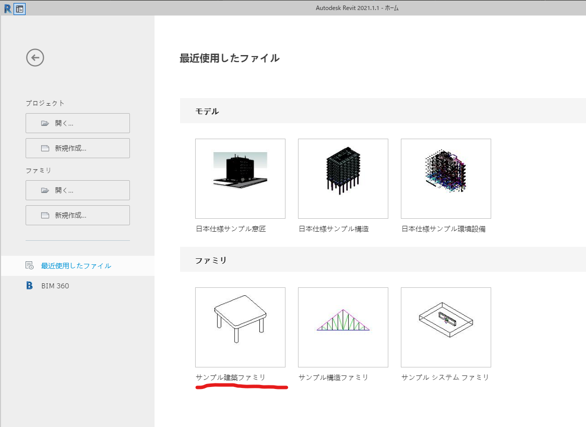

# #01 導入/操作方法/リソース

## 導入 

Revit2021がインストールされていることを確認し、開きます。

適当にファミリのテンプレートを選択します。（今後説明がない限り、上のちゃぶ台を選択して作業していきます。）

管理>ビジュアルプログラミング　より、Dynamoを起動します。

右下のサンプルファイルより、`Basics_Basic02.dyn`を開きます。

## 操作方法

`Basics_Basic02.dyn`を開くと、ノードと呼ばれる数値やデータを格納するコンポーネントがワイヤーでつながっているグループが出現します。

**ホイールをドラッグ**すると、**画面をパン**することができます。

Dynamoには二種類のナビゲーション方法が用意されています:

* グラフビューナビゲーション(現在有効になっている方)
* 背景3Dプレビューナビゲーション

.png>)

右上のボタンで切り替えることができるので、背景3Dプレビューナビゲーションに切り替えてください。

前面にあったノードがグレイアウトし、グリッドの置かれた3D空間をいじることができます。

こちらも**ホイールをドラッグ**して**画面をパン**、**右ドラッグ**で**ビューを回転**することができます。

グラフビューに戻しておきましょう。


Esc.キーを押しているあいだ、一時的にグラフビューと3Dプレビューを切り替えることができます。


.png>)


RevitでDynamoを使用するときは、Dynamo内の二つのナビゲーションモードと、Revit内に表示されているプレビューを確認しながら作業することになりますので、常にこれら３つをケアしておきましょう。


## リソース

Googleが一番の先生ですが、自学自習する際やAPIを参照する際に有用となるリンクを貼っておきます。

| Link                                                                                                | Content                                           |
| --------------------------------------------------------------------------------------------------- | ------------------------------------------------- |
| [Dynamo Primer](https://primer.dynamobim.org)                                                       | Dynamoの初歩から、応用まで全部書いてあります。このサイトを一緒にやるだけの回も全然あります。 |
| [Autodesk Forums](https://forums.autodesk.com/t5/revit-products/ct-p/2003)                          | Autodesk公式のフォーラムが案外役に立つことがあります。                   |
| [The Building Coder](https://thebuildingcoder.typepad.com/blog/dynamo/)                             | Dynamo以外も、Autodesk製品をいろいろ深いところまで解説してくれている人がおります。  |
| [DesignScript Language Specification](https://dynamobim.org/wp-content/links/DesignScriptGuide.pdf) | DesignScriptのSyntaxや例題など調べるときに使います。               |
| [Revit API Docs](https://www.revitapidocs.com)                                                      | RevitのAPIを調べるときに使います。                             |
| [C3D .NET API Docs](http://docs.autodesk.com/CIV3D/2019/ENU/API_Reference_Guide/index.html)         | Civil 3Dの.NETのAPIを調べるときに使います。                     |
| [これのMiroボード](https://miro.com/app/board/o9J_kheBEAU=/)                                              | このプロジェクトの、Miroというオンラインホワイトボードのボード。                |

